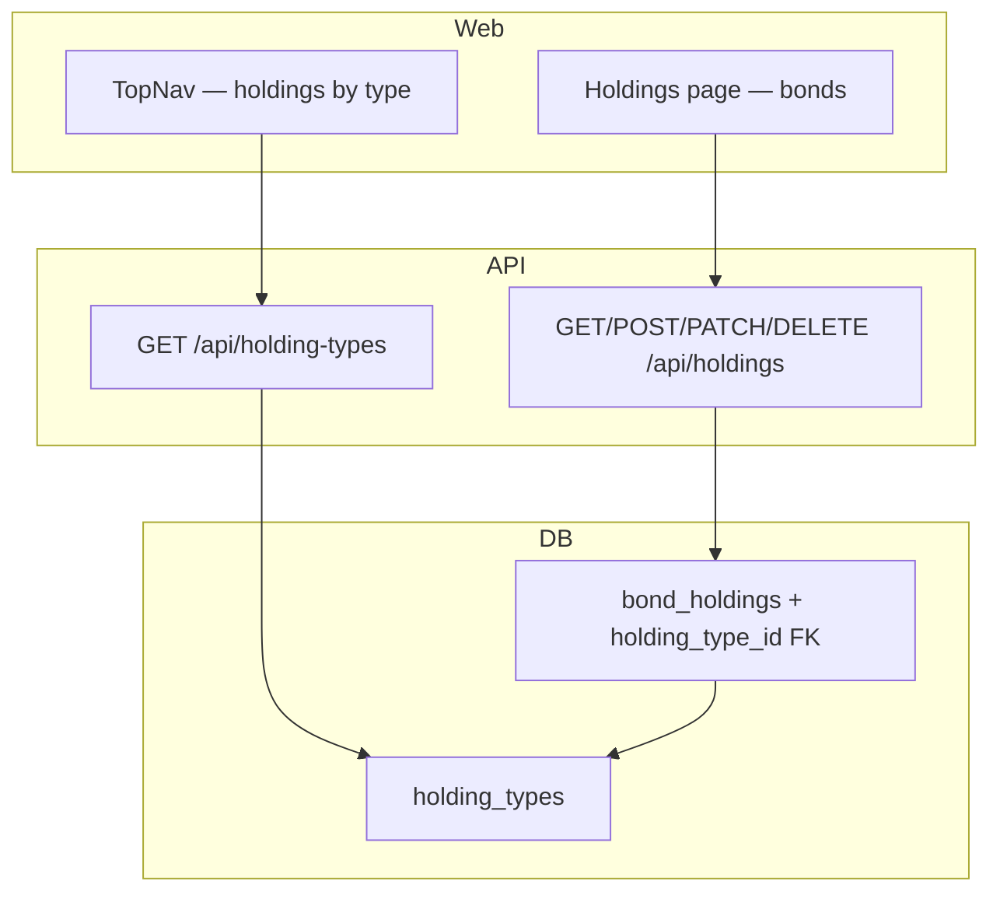

# M5 Design — Holdings Framework

**Spec**: `.specs/features/active/m5-holdings-framework/spec.md`  
**Status**: Approved (2026-05-29)  
**Scope**: Large — schema migration + API surface + nav restructure

---

## Architecture Overview

M5 adds a **read-only Holding Type catalog** and links existing bond rows to the **Bond** type. No new holding CRUD beyond bonds.



**No new npm package.** Extend `bonds-domain` with `HOLDING_TYPE_SLUGS` and shared Zod schemas.

---

## Schema Changes

### New table: `holding_types`

| Column | Type | Notes |
| --- | --- | --- |
| `id` | integer PK | |
| `slug` | text UNIQUE NOT NULL | `bond`, `brazilian-fixed-income` |
| `name` | text NOT NULL | Display: "Bond", "Brazilian Fixed Income" |
| `sort_order` | integer NOT NULL | Nav order |

**Seed (migration):**

| slug | name | sort_order |
| --- | --- | --- |
| `bond` | Bond | 10 |
| `brazilian-fixed-income` | Brazilian Fixed Income | 20 |

### Alter: `bond_holdings`

| Column | Type | Notes |
| --- | --- | --- |
| `holding_type_id` | integer FK → `holding_types.id` NOT NULL | Default Bond on migration |

**Migration steps:**

1. Create `holding_types`; insert seed rows
2. Add nullable `holding_type_id` to `bond_holdings`
3. Backfill all rows → Bond type id
4. Set NOT NULL + FK constraint

---

## API Changes

### New route: `GET /api/holding-types`

```json
[
  { "id": 1, "slug": "bond", "name": "Bond", "sortOrder": 10 },
  { "id": 2, "slug": "brazilian-fixed-income", "name": "Brazilian Fixed Income", "sortOrder": 20 }
]
```

### Updated: `GET /api/holdings`

- Query: optional `holdingTypeId` (integer)
- Response items include:

```json
{
  "id": 1,
  "holdingType": { "id": 1, "slug": "bond", "name": "Bond" },
  "issuer": "...",
  "...": "..."
}
```

### Updated: `POST /api/holdings`

- Server sets `holding_type_id` to Bond; reject if body includes non-bond type id

### Unchanged paths

Bond CRUD URLs stay `/api/holdings/*` for backward compatibility.

---

## Web Changes

| Area | Change |
| --- | --- |
| `TopNav.tsx` | Fetch holding types; render Holdings submenu (Bond → `/holdings`; BRFI placeholder until M7) |
| `Holdings.tsx` | Optional: show type badge column (Bond) — low priority P2 |
| `types/api.ts` | Add `ApiHoldingType`; extend `ApiBondHolding` |
| Routes | No new routes in M5 |

**Nav placeholder for BRFI:** Disabled menu item with `aria-disabled` and caption "Coming in v2" — removed in M7 when route ships.

---

## Code Locations

| Concern | Location |
| --- | --- |
| Drizzle schema | `packages/api/src/schema.ts` |
| Migration SQL | `packages/api/src/migrations/` |
| Seed script | Same migration or `scripts/seed-holding-types.ts` |
| Repo queries | `packages/api/src/repo.ts` |
| Routes | `packages/api/src/routes/holding-types/list.ts`, update `holdings/*` |
| Domain constants | `packages/bonds-domain/src/holdingTypes.ts` (new) |
| Web nav | `packages/web/src/components/ui/TopNav.tsx` |

---

## Testing Strategy

| Layer | Focus |
| --- | --- |
| API integration | `GET /api/holding-types`; holdings filter; migration backfill |
| Web unit | TopNav renders types from mock API |
| Regression | Full existing holdings/account/coupon tests unchanged |

---

## Risks & Mitigations

| Risk | Mitigation |
| --- | --- |
| Breaking API clients expecting old holdings shape | Additive `holdingType` field only |
| Nav complexity on mobile | Reuse existing TopNav dropdown patterns from DESIGN.md |
