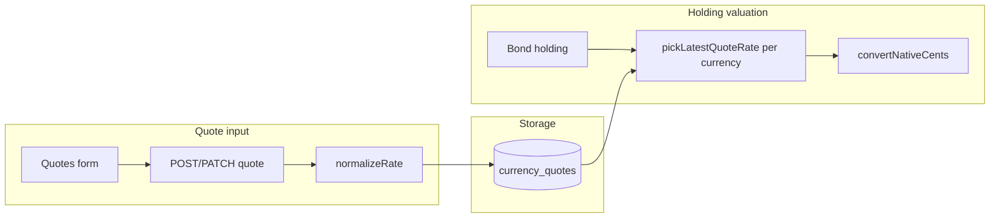

# M6.1 — Multi-Currency Follow-Ups Design

**Spec:** [spec.md](./spec.md)  
**Status:** Draft (2026-05-31)

## Overview

M6.1 tightens the FX pipeline: **normalize on write**, **value on purchase date**, **validate on create**, and **return converted values on every valuation response**. The web app does not implement FX rules — it displays API fields and sends `displayCurrency` as a query parameter. No schema migration required unless we add `rate_direction` audit column (optional — direction is ephemeral on input only).



## Components

### 1. Domain — rate normalization

**File:** `packages/bonds-domain/src/currency.ts`

Add:

```ts
export type RateDirection = 'usd-to-target' | 'target-to-usd';

export function normalizeUsdToTargetRate(
  rate: number,
  direction: RateDirection = 'usd-to-target'
): number;
```

- `usd-to-target`: return `rate`
- `target-to-usd`: return `1 / rate` (guard `rate > 0`)
- Round to **6 decimal places** before persist (SQLite `real`; avoids drift on invert)

Extend `createCurrencyQuoteSchema` / `updateCurrencyQuoteSchema` with optional `rateDirection` (default `usd-to-target`).

### 2. Domain — per-holding rate map

Add helper:

```ts
export function buildQuoteRateMapForHolding(
  quoteHistory: ReadonlyMap<string, ReadonlyArray<{ quoteDate: string; rate: number }>>,
  purchaseDate: string
): QuoteRateMap;
```

Implementation: delegate to existing `buildQuoteRateMap(history, purchaseDate)`.

Add:

```ts
export function hasApplicableQuote(
  currencyCode: string,
  purchaseDate: string,
  quoteHistory: ...
): boolean;
```

- USD → always `true`
- Else → `pickLatestQuoteRate` not null

### 3. API repo — conversion path

**File:** `packages/api/src/repo.ts`

**Valuation helper** (internal):

```ts
function resolveDisplayCurrency(query?: string): string // default USD
function attachConvertedFields(holding, convertedCurrency, groupedHistory): BondHoldingWithConverted
```

**Change `listBondHoldingsFiltered` (and GET by id via same mapper):**

- **Always** run valuation (remove early return when `displayCurrency` is USD or omitted)
- `convertedCurrency = resolveDisplayCurrency(options?.displayCurrency)` default **`USD`**
- Load grouped quote history once per request
- Per holding: `buildQuoteRateMap(grouped, purchaseDateIso)` → `convertNativeCents` → set `convertedFaceValue` / `conversionError`
- Original fields unchanged: `faceValue`, `currencyCode`

**Change `getPortfolioSummary`:**

- Always attach `convertedCurrency`, `convertedTotalFaceValue`, `convertedTotalCostBasis` using per-holding purchase-date maps
- Ladder items include `convertedFaceValue` + `convertedCurrency`
- If any holding cannot convert, set totals to null and `conversionError` at summary level (or per M6.1 spec: partial — prefer **null converted totals** + error flag)

**Insert/update holding:**

- Before insert/update: `assertApplicableQuote(currencyCode, purchaseDate)`
- Throw domain/repo error → HTTP 400 `EXCHANGE_RATE_REQUIRED`

**Quote CRUD:**

- Apply `normalizeUsdToTargetRate` in `insertCurrencyQuote` / `updateCurrencyQuote`

### 4. API routes

| Route | Change |
| --- | --- |
| `POST/PATCH /api/currency-quotes` | Accept optional `rateDirection`; persist normalized rate |
| `POST/PATCH /api/holdings` | Exchange-rate validation via repo |
| `GET /api/holdings` | `displayCurrency` optional, default **USD**; response always includes `convertedFaceValue`, `convertedCurrency`; remove `asOfDate` |
| `GET /api/holdings/:id` | Same converted fields on single resource |
| `GET /api/portfolio/summary` | `displayCurrency` optional, default USD; always return `converted*` totals |
| **`GET /api/fx/convert`** | **New** — form preview; see below |

**Rename in JSON (breaking within v2 dev):** prefer `convertedFaceValue` / `convertedCurrency` over optional `displayFaceValue`. Implementation may alias during transition; tests target final names.

#### `GET /api/fx/convert`

Query: `amountCents`, `currencyCode`, `purchaseDate` (YYYY-MM-DD), `convertedCurrency` (optional, default `USD`).

Response 200:

```json
{
  "convertedFaceValue": 600000,
  "convertedCurrency": "USD",
  "conversionError": null
}
```

Response when quote missing: 200 with `convertedFaceValue: null`, `conversionError: "EXCHANGE_RATE_REQUIRED"` (keeps form UX simple) **or** 400 — **locked: 200 + error field** so web can show inline without treating as transport error.

### 5. Web — Holding form (UI only)

**File:** `packages/web/src/components/HoldingForm.tsx`

- Debounced `GET /api/fx/convert?...` when face value, currency, purchase date change
- Read-only USD field binds to response `convertedFaceValue`
- Disable submit when `conversionError` present (UI rule)
- **Do not** import `bonds-domain`

**Deferred to M7:** Interest type (Simple / Compound) on holding forms.

### 6. Web — Holdings table (UI only)

**File:** `packages/web/src/components/HoldingsTable.tsx`

- Primary: `formatCurrency(holding.convertedFaceValue, holding.convertedCurrency)` — no fallback to `faceValue`
- Secondary: `formatCurrency(holding.faceValue, holding.currencyCode)`
- Remove props that duplicate API currency (`displayCurrency` prop may remain for empty-state copy only, not for math)
- `title` attribute tooltips on metric spans

### 7. Web — Currency quotes page

**File:** `packages/web/src/pages/CurrencyQuotes.tsx`

- Filter bar: start date, end date, target currency (build query string)
- Table: `${code} (${symbol})` from `/api/currencies` lookup
- Quote form: optional direction toggle (advanced) or helper text “Rate = USD → currency”

## Error codes

| Code | HTTP | When |
| --- | --- | --- |
| `EXCHANGE_RATE_REQUIRED` | 400 | Non-USD holding without quote on/before purchase date |
| `VALIDATION_ERROR` | 400 | Invalid `rateDirection` or non-positive rate |

## Testing strategy

| Layer | Focus |
| --- | --- |
| bonds-domain | `normalizeUsdToTargetRate`, purchase-date map, fixture table from spec |
| api repo | Per-holding conversion integration with seeded quotes |
| api routes | 400 on missing quote; holdings list fixture assertions |
| web | Render API `converted*` fields; preview via `/api/fx/convert`; quotes filters — **no FX unit tests for math** |

## Risks

| Risk | Mitigation |
| --- | --- |
| N+1 quote lookups | Load grouped history once per request |
| Breaking clients using `asOfDate` on holdings | Remove param from route; purchase date only |
| Breaking optional `displayFaceValue` | Always return `convertedFaceValue`; default currency USD |
| Web importing bonds-domain | ESLint/workspace rule: web must not depend on bonds-domain for FX (if dep exists for types only, OK) |
| Invert rounding | Round normalized rate; test round-trip |

## Files touched (expected)

- `packages/bonds-domain/src/currency.ts`, validators, tests
- `packages/api/src/repo.ts`, `routes/holdings/*`, `routes/currency-quotes/crud.ts`, tests
- `packages/web/src/components/HoldingForm.tsx`, `HoldingsTable.tsx`, `CurrencyQuotes.tsx`, tests
- `docs/FRONTEND.md` (Holdings + quotes UX)
