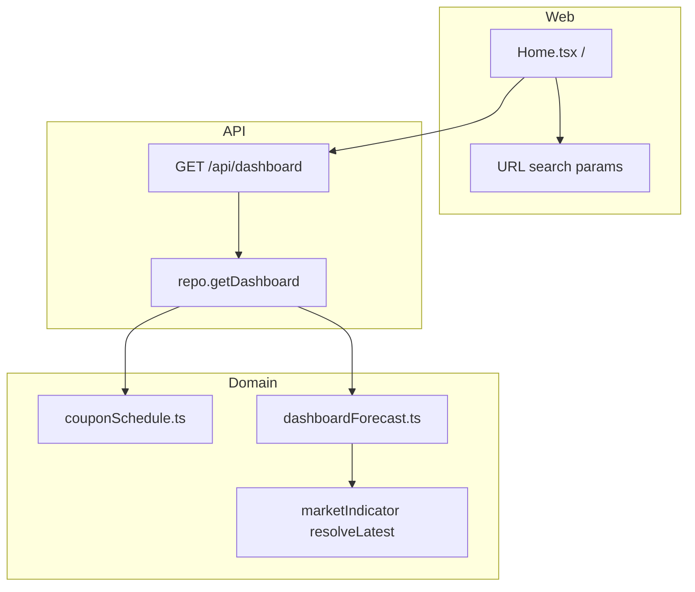

# M9 Design — Dashboard

**Spec**: `.specs/features/completed/m9-dashboard/spec.md`  
**Status**: Approved (2026-06-05)  
**Depends on**: M5, M6, M7, M8  
**Release**: **v2.0.0** (with M5–M8)

---

## Architecture Overview



**AD-010:** Home sends query params only (`displayCurrency`, `accountId`, `holdingTypeSlug`, `from`, `to`, `limit`). Allocations, yearly forecasts, and event amounts are computed in `bonds-domain` + `repo.getDashboard` — never in React.

**No schema changes.** Dashboard reads existing holdings, quotes, and M8 indicator values.

---

## Domain — `packages/bonds-domain/src/dashboardForecast.ts`

New pure functions (exported from `index.ts`):

### BRFI effective annual rate (%)

| Indexing | Formula |
| --- | --- |
| `PRE_FIXED` | `preFixedRatePercent` |
| `CDI_PERCENTAGE` | `latestValue × (cdiPercentage / 100)` |
| `SELIC` | `latestValue` |
| `IPCA_SPREAD` | `latestValue + ipcaSpreadPercent` |

`latestValue` = M8 annualized percentage (e.g. 14.75 = 14.75%). Returns `null` when index-linked and `latestValue` missing.

### BRFI annual interest (cents)

```ts
export function brFiAnnualInterestCents(
  investedAmountCents: number,
  indexingType: IndexingType,
  params: { preFixedRatePercent?; cdiPercentage?; ipcaSpreadPercent?; latestIndicatorValue? }
): { amountCents: number } | { missingIndicator: true }
```

`amountCents = round(investedAmountCents × effectiveRatePercent / 100)`.

### Interest payment dates

One estimated interest event per **purchase anniversary** (same UTC month/day as `purchaseDate`) strictly after `from` and on/before `min(maturityDate, to)`. Skip anniversaries after maturity.

### Bond income events

Reuse `generateEstimatedCouponDates` + `expectedCouponAmountCents` + `isPaymentDateWithinHolding`. Filter dates to `[from, to]`.

### Year buckets

```ts
export function bucketAmountsByCalendarYear(
  events: { date: string; amountCents: number; kind: 'coupon' | 'interest' }[],
  from: string,
  to: string
): { year: number; couponCents: number; interestCents: number; totalCents: number }[]
```

Only events with `from ≤ date ≤ to`. Years derived from UTC date prefix `YYYY`.

### Principal by year

Maturity events: bond `faceValue`, BRFI `investedAmountCents`. Group by `maturityDate` calendar year where `from ≤ maturityDate ≤ to` and `maturityDate ≥ today` (exclude past maturities from forecast).

### Allocation percentages

```ts
export function withAllocationPercents<T extends { valueCents: number }>(
  rows: T[],
  totalCents: number
): (T & { percentage: number })[]
```

`percentage = totalCents > 0 ? round(valueCents / totalCents × 10000) / 100 : 0` (two decimal places).

### Unified upcoming events

Merge bond coupons, BRFI interest anniversaries, maturities (bond + BRFI). Sort ascending by date. Types: `COUPON` | `INTEREST` | `MATURITY`. Truncate to `limit` after sort.

Event `label`: bond `issuer`, BRFI `name`. `holdingKind`: `bond` | `br-fi`.

---

## API — `GET /api/dashboard`

**Route:** `packages/api/src/routes/dashboard/get.ts`  
**Register:** `packages/api/src/server.ts`

### Query params

| Param | Default | Validation |
| --- | --- | --- |
| `displayCurrency` | `USD` | 3-letter ISO; must have quotes if non-USD holdings need conversion |
| `accountId` | — | Positive int string; 404 if account missing |
| `holdingTypeSlug` | — | `bond` \| `brazilian-fixed-income`; 400 if unknown |
| `from` | today UTC | ISO `YYYY-MM-DD` |
| `to` | today + 3 years UTC | ISO `YYYY-MM-DD`; `from ≤ to` |
| `limit` | `20` | 1–100 |

### Response shape

```json
{
  "summary": {
    "totalPortfolioValueCents": 0,
    "convertedTotalPortfolioValueCents": 0,
    "convertedCurrency": "USD",
    "conversionError": null,
    "positionCount": 0,
    "accountCount": 0,
    "currencyCount": 0,
    "totalFaceValueCents": 0,
    "totalInvestedCents": 0,
    "convertedTotalFaceValueCents": 0,
    "convertedTotalInvestedCents": 0
  },
  "allocationByType": [
    { "slug": "bond", "name": "Bond", "valueCents": 0, "convertedValueCents": 0, "percentage": 0 }
  ],
  "allocationByAccount": [
    { "accountId": "1", "name": "Broker A", "valueCents": 0, "convertedValueCents": 0, "percentage": 0 }
  ],
  "projectedIncomeByYear": [
    { "year": 2026, "couponCents": 0, "interestCents": 0, "totalCents": 0, "convertedCouponCents": 0, "convertedInterestCents": 0, "convertedTotalCents": 0 }
  ],
  "principalForecastByYear": [
    { "year": 2027, "principalCents": 0, "convertedPrincipalCents": 0 }
  ],
  "upcomingEvents": [
    {
      "date": "2026-09-15",
      "type": "COUPON",
      "holdingKind": "bond",
      "holdingId": "1",
      "label": "Issuer",
      "amountCents": 5000,
      "currencyCode": "USD",
      "convertedAmountCents": 5000,
      "convertedCurrency": "USD"
    }
  ],
  "warnings": {
    "holdingsMissingIndicator": 0
  }
}
```

Empty portfolio: zeros and empty arrays (200, not 404).

Index-linked BRFI without latest value: omit interest events; increment `warnings.holdingsMissingIndicator`; optional per-year breakdown flag deferred (summary count only for M9).

---

## Repo — `getDashboard(filters: DashboardFilters)`

**File:** `packages/api/src/repo.ts`

1. Resolve filters (defaults for `from`/`to`/`limit`/`displayCurrency`).
2. Load filtered bonds (`listBondHoldingsFiltered`) and BRFI (`listBrFiHoldingsFiltered` + holding type slug filter).
3. Load quote history for FX (reuse existing helpers).
4. Compute native + converted values per holding (bond face, BRFI invested).
5. Build summary totals, allocation by type (reuse/extend `byHoldingType` logic), allocation by account (new group-by).
6. Call domain forecast fns for income/principal/events.
7. Convert forecast/event amounts to display currency when possible (same purchase-date FX as M6.1 for holdings; events use holding's currency + quote at event date = purchase-date rule for consistency — **use holding purchase-date rate** for converted event amounts to match list pattern).

---

## Web Changes

| Area | Change |
| --- | --- |
| `Home.tsx` | Single `useApi` → `/api/dashboard?...`; build URL from `displayCurrency` + `useSearchParams` filters |
| `Home.css` | New sections: allocation tables, yearly forecast tables, events list; filter bar |
| `types/api.ts` | `ApiDashboard` + nested types |
| `utils/dashboardUrl.ts` | Build dashboard URL from filter state |

### Filter UX

- Account `<Select>` from `GET /api/accounts`
- Holding type `<Select>`: All | Bond | Brazilian Fixed Income
- Date range: `from` / `to` `<input type="date">`
- Persist all in URL search params; refetch on change

### Web must not

- Compute allocation %, yearly totals, or event amounts locally
- Import `bonds-domain` runtime forecast functions

Existing `GET /api/portfolio/summary`, `income-summary`, `upcoming-coupons` **remain** for Income page and backward compatibility; Home stops calling them.

---

## Error Codes

| Code | When |
| --- | --- |
| `VALIDATION_ERROR` | Invalid dates, `from > to`, bad `holdingTypeSlug`, bad `limit` |
| `NOT_FOUND` | Unknown `accountId` |
| `INVALID_DISPLAY_CURRENCY` | Unknown currency code |

---

## Testing Strategy

| Layer | Focus |
| --- | --- |
| Domain | BRFI rate matrix (pre-fixed, CDI, SELIC, IPCA+spread, missing indicator); year bucketing; allocation % |
| Repo | Filter scoping; empty portfolio; mixed bond+BRFI |
| API | Full response shape; query validation; 404 account |
| Web | Single fetch URL; render sections from fixture JSON; filter URL sync |

---

## Docs to Update (P3)

- `ARCHITECTURE.md`, `API-FIRST.md` (M9 shipped), `STRUCTURE.md`, `docs/FRONTEND.md`
- `STATE.md`, `ROADMAP.md`, `.specs/index.md`, `AGENTS.md`
- Archive `active/m9-dashboard/` → `completed/`
