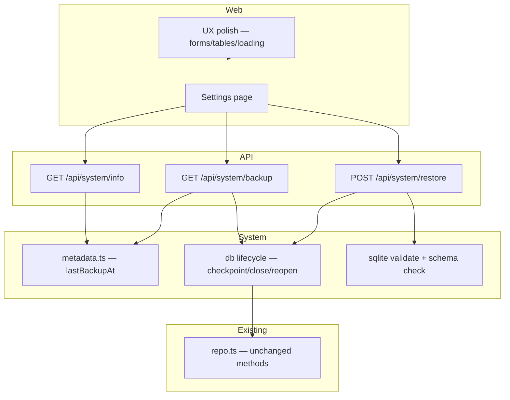

# M4 Design — v1 Polish (Backup/Restore & UX)

**Spec**: `.specs/features/m4-v1-polish/spec.md`  
**Status**: Approved (2026-05-23)  
**Scope**: Large — backup/restore touches DB lifecycle; full design + task breakdown before Execute

---

## Architecture Overview

M4 adds **system endpoints** and a **settings page** without new packages or schema migrations. The main architectural change is a **mutable database connection** so restore can replace the SQLite file in-process (per spec M4-08).

Same stack: **Web → Fastify API → system service + existing repo → SQLite**.



**Layer split:**

| Concern | Location |
| --- | --- |
| Version string | `APP_VERSION` env + `system/version.ts` |
| Last backup timestamp | Sidecar JSON beside DB directory (`metadata.ts`) |
| Backup snapshot | WAL checkpoint + stream file (`system/backup.ts`) |
| Restore replace + reconnect | Close handle → pre-copy → write → reopen → new repo (`system/restore.ts`, `appState.ts`) |
| SQLite file validation | Magic header + minimum size (`system/validateSqlite.ts`) |
| Schema version guard | Compare `user_version` / drizzle journal after open |
| Settings UI | `pages/Settings.tsx` |
| Form focus on error | Shared `utils/focusFirstFieldError.ts` |

**No bonds-domain changes.** **No Drizzle migration** for M4 features.

---

## Code Reuse Analysis

### Existing Components to Leverage

| Component | Location | How to Use |
| --- | --- | --- |
| Route registration pattern | `packages/api/src/routes/**` | New `routes/system/*.ts`; wire in `server.ts` |
| Error middleware | `middleware/errors.ts` | Add `PayloadTooLargeError` or map 413 inline; reuse `FieldValidationError` for bad uploads |
| `dbPath`, `createConnection` | `db.ts` | Extend with close/reopen; export directory helper |
| `createRepo` | `repo.ts` | Recreate after reconnect |
| `createServer(database?)` | `server.ts` | Tests keep in-memory DB; prod uses `appState` |
| `useApi`, `useApiMutation` | `hooks/` | Settings info fetch; restore may use raw `fetch` + `FormData` |
| `ConfirmDialog` | `components/forms/` | Destructive restore confirmation |
| `PageHeader`, metric cards | `components/ui/`, `Home.css` | Settings info cards reuse `cb-home__metric-card` |
| `EmptyState`, `ErrorBanner` | `components/ui/` | Settings errors |
| Skeleton patterns | `HoldingsTableSkeleton`, `AccountsSkeleton` | Template for coupon payments + income refetch |
| Mobile table CSS | `Income.css`, `CouponPaymentsTable.css` | Extend `@media (max-width: 639px)` rules |

### Integration Points

- **Docker:** Set `APP_VERSION` at image build from release tag; document in `docker/api/Dockerfile` ARG
- **nginx web:** No change — `/api/` proxy already handles binary responses
- **Entrypoint:** Existing `migrate.js` on container start handles restored older-schema files on next deploy; in-process restore calls `migrate()` after reopen (see Restore flow)

---

## Prerequisite Refactor: Mutable Repo Access

**Problem:** Routes register with a captured `repo: Repo` closure. After restore, a new `createRepo(newDb)` is required; old closure stays stale.

**Solution:** Introduce `appState.ts` and change route registration to `getRepo: () => Repo`.

### New: `packages/api/src/appState.ts`

```ts
import { createConnection, type Database } from './db.js';
import { createRepo, type Repo } from './repo.js';

export type AppState = {
  getDb: () => Database;
  getRepo: () => Repo;
  reconnect: (databaseUrl?: string) => void;
};

export function createAppState(initialDb: Database): AppState {
  let db = initialDb;
  let repo = createRepo(db);

  return {
    getDb: () => db,
    getRepo: () => repo,
    reconnect: (databaseUrl?: string) => {
      closeDatabase(db);
      db = databaseUrl ? createConnection(databaseUrl) : createConnection();
      repo = createRepo(db);
    },
  };
}
```

### Update: `packages/api/src/db.ts`

Add:

```ts
export function getDatabaseDirectory(dbFilePath: string): string;
export function closeDatabase(database: Database): void;
export function checkpointWal(database: Database): void;
```

Implementation notes:

- `closeDatabase` calls underlying `better-sqlite3` `.close()` from drizzle's `$client` (or store handle alongside drizzle wrapper)
- `checkpointWal` runs `PRAGMA wal_checkpoint(TRUNCATE)` before backup read
- `getDatabaseDirectory` = `path.dirname(path.resolve(dbPath))`

Keep `export const db = createConnection()` for backward compat; `createAppState(db)` used in `createServer`.

### Route signature change (mechanical)

**Before:** `registerPostAccount(app, repo: Repo)`  
**After:** `registerPostAccount(app, getRepo: () => Repo)`

Each handler starts with `const repo = getRepo();`. Touch all files under `routes/` (~12 register functions). Tests pass `() => repo` from test fixture.

**Commit boundary:** `refactor(api): route handlers use getRepo factory` — separate from M4 feature commits.

---

## System Module (`packages/api/src/system/`)

### `version.ts`

```ts
export function getAppVersion(): string {
  return process.env.APP_VERSION?.trim() || 'dev';
}
```

Docker build (release script):

```dockerfile
ARG APP_VERSION=dev
ENV APP_VERSION=$APP_VERSION
```

Pass `--build-arg APP_VERSION=1.0.0` from `investment-tracker-release.sh`.

### `metadata.ts`

Sidecar file: `{dbDir}/.last-backup.json`

```json
{ "lastBackupAt": "2026-05-23T14:30:00.000Z" }
```

| Function | Behavior |
| --- | --- |
| `readLastBackupAt(dbDir)` | Parse JSON; return ISO string or `null` if missing/invalid |
| `writeLastBackupAt(dbDir, iso)` | Atomic write (write temp + rename) |

Not stored inside SQLite so restore does not erase backup history.

### `validateSqlite.ts`

```ts
const SQLITE_MAGIC = 'SQLite format 3';

export function isValidSqliteBuffer(buffer: Buffer): boolean;
export function assertRestorableSchema(db: Database): void; // throws FieldValidationError
```

**Validation steps:**

1. Buffer length ≥ 100 bytes
2. First 16 bytes match `SQLite format 3\0`
3. After open (temp or in-memory attach): required tables exist (`accounts`, `bond_holdings`, `coupon_payments`) — query `sqlite_master`
4. **Newer schema guard:** If backup's max migration index > app's expected → throw `400` "Backup requires a newer app version"

For (4), read `__drizzle_migrations` or compare `user_version` pragma against known max for current app. Simplest v1: attempt `migrate()` on temp copy; if migration folder has no pending, accept; if backup has unknown tables only, reject.

Pragmatic v1 rule:

- Open uploaded bytes to **temp file** in db dir
- Run same `migrate()` as entrypoint on temp path (in subprocess or separate connection)
- If migrate throws → 400 invalid/incompatible backup
- If migrate succeeds → proceed with replace

### `backup.ts`

```ts
export type BackupResult = {
  filename: string;
  stream: ReadableStream | NodeJS.ReadableStream;
  byteLength?: number;
};

export function createBackupStream(state: AppState): BackupResult;
```

**Algorithm:**

1. `checkpointWal(state.getDb())`
2. Build filename `investment-tracker-backup-${new Date().toISOString().replace(/[:.]/g, '-')}.db`
3. **Option A (preferred):** Use `better-sqlite3` `.backup(destinationPath)` to temp file, create read stream, delete temp on stream end
4. **Option B:** Read live file after checkpoint (acceptable for solo v1 if WAL truncated)

5. On stream pipeline success (route handler), call `writeLastBackupAt`

Route sets headers:

```
Content-Type: application/octet-stream
Content-Disposition: attachment; filename="investment-tracker-backup-....db"
```

### `restore.ts`

```ts
export type RestoreResult = { restoredAt: string };

let restoreInProgress = false;

export async function restoreDatabaseFromUpload(
  state: AppState,
  fileBuffer: Buffer
): Promise<RestoreResult>;
```

**Algorithm:**

1. If `restoreInProgress` → throw 409 `CONFLICT`
2. Set flag; try/finally clear flag
3. `assertValidSqliteBuffer(fileBuffer)`
4. **Pre-restore copy:** Copy current db file to `{dbDir}/.pre-restore-{timestamp}.db`
5. Write upload to `{dbDir}/.restore-incoming.db`
6. Validate/migrate temp: open connection to `.restore-incoming.db`, run migrate helper
7. `closeDatabase(state.getDb())`
8. Replace: rename `.restore-incoming.db` → main db path (atomic where FS allows)
9. `state.reconnect()` — reopens main path
10. Run `migrate()` on live connection (idempotent)
11. Return `{ restoredAt: new Date().toISOString() }`

On failure after step 7: attempt rename pre-restore copy back (best-effort); return 500.

**Note:** `lastBackupAt` sidecar is **not** modified by restore (still reflects last download backup).

### Restore mutex

Single-process flag sufficient for v1. Document that concurrent restore returns 409.

---

## API Layer

### New dependency

Add `@fastify/multipart` to `@investment-tracker/api` for `POST /api/system/restore`.

Register in `createServer`:

```ts
await app.register(multipart, {
  limits: { fileSize: parseRestoreMaxBytes() }, // default 32 * 1024 * 1024
});
```

Env: `RESTORE_MAX_BYTES` (optional override).

### Routes (new files)

| File | Method | Path | Notes |
| --- | --- | --- | --- |
| `system/info.ts` | GET | `/api/system/info` | `{ version, databasePath, lastBackupAt }` |
| `system/backup.ts` | GET | `/api/system/backup` | Stream; update metadata on success |
| `system/restore.ts` | POST | `/api/system/restore` | Multipart field `file`; 200 JSON |

### Route handlers

**info.ts**

```ts
export function registerSystemInfo(app: FastifyInstance, state: AppState): void {
  app.get('/api/system/info', async () => ({
    version: getAppVersion(),
    databasePath: path.resolve(dbPath),
    lastBackupAt: readLastBackupAt(getDatabaseDirectory(dbPath)),
  }));
}
```

**backup.ts** — pipe stream to reply; on `finish`, write metadata.

**restore.ts** — `await request.file()`; require field name `file`; read buffer; call `restoreDatabaseFromUpload`.

### Error handling

| Condition | Status | Body |
| --- | --- | --- |
| Invalid / non-SQLite upload | 400 | `VALIDATION_ERROR`, `fields.file` |
| Backup newer than app | 400 | `VALIDATION_ERROR`, message upgrade app |
| File too large | 413 | `PAYLOAD_TOO_LARGE` or Fastify default |
| Restore already in progress | 409 | `CONFLICT` |
| DB dir not writable | 500 | `INTERNAL_ERROR` |
| Backup read failure | 500 | `INTERNAL_ERROR` |

### server.ts

```ts
export async function createServer(initialDb: Database = db): Promise<FastifyInstance> {
  const state = createAppState(initialDb);
  const getRepo = () => state.getRepo();

  // ... existing setup ...

  registerSystemInfo(app, state);
  registerSystemBackup(app, state);
  registerSystemRestore(app, state);

  registerPostAccount(app, getRepo);
  // ... all other routes use getRepo ...
}
```

Export `createAppState` for tests if needed.

### Tests (`packages/api/__tests__/`)

| File | Cases |
| --- | --- |
| `system.test.ts` (new) | info shape; backup returns sqlite magic; backup updates metadata; restore round-trip (seed → backup → mutate → restore → assert); invalid file 400; oversize 413; concurrent restore 409 |
| `routes.test.ts` | Regression: CRUD still works after restore via getRepo |

Use temp directory for `DATABASE_URL` in system tests (not `:memory:` — restore needs file paths).

---

## Web Layer

### Types (`packages/web/src/types/api.ts`)

```ts
export interface ApiSystemInfo {
  version: string;
  databasePath: string;
  lastBackupAt: string | null;
}

export interface ApiRestoreResult {
  restoredAt: string;
}
```

### New page: `pages/Settings.tsx` + `Settings.css`

**Layout:**

```
PageHeader — "Settings" / subtitle "System information and data backup"

Section: System information (aria-label)
  Metric cards: App version | Database path | Last backup
  Last backup: formatDateTime or "Never"

Section: Backup & restore
  [Download backup] primary button — loading while fetch/blob download
  File input (hidden) + [Restore from backup] secondary — opens file picker
  ConfirmDialog on restore — destructive copy
  ErrorBanner for failures
```

**Download backup flow:**

```ts
const response = await fetch(`${API_BASE}/api/system/backup`);
const blob = await response.blob();
// trigger <a download> with Content-Disposition filename or fallback
```

Refetch `GET /api/system/info` after successful download to refresh Last backup.

**Restore flow:**

```ts
const formData = new FormData();
formData.append('file', file);
await fetch(`${API_BASE}/api/system/restore`, { method: 'POST', body: formData });
window.location.href = '/'; // full reload per spec
```

Use `ConfirmDialog` before POST. Disable buttons while in flight.

### Router + TopNav

```ts
// TopNav.tsx — add before Accounts or after Income
{ to: '/settings', label: 'Settings', end: false }

// App.tsx
<Route path="/settings" element={<Settings />} />
```

Update `topNav.test.tsx`, `app.test.tsx`.

### Tests

| File | Cases |
| --- | --- |
| `settings.test.tsx` (new) | Renders info; download triggers fetch; restore shows confirm then FormData POST; Never when null lastBackupAt |
| `topNav.test.tsx` | Settings link href |
| `app.test.tsx` | `/settings` route resolves |

---

## UX Polish (P3)

### Shared: `utils/focusFirstFieldError.ts`

```ts
/**
 * @param fieldOrder — DOM field keys in visual order matching FormField htmlFor ids
 */
export function focusFirstFieldError(
  fieldErrors: Record<string, string>,
  fieldOrder: string[]
): void;
```

Implementation: find first key in `fieldOrder` present in `fieldErrors`; `document.getElementById(key)?.focus()`.

Call from submit handlers in:

| Form | Field order (ids) |
| --- | --- |
| `HoldingForm` | accountId, issuer, faceValue, couponRate, maturityDate, purchaseDate, ... |
| `AccountForm` | name (verify actual ids) |
| `CouponPaymentForm` | payment-date, payment-amount |

Also call in `useEffect` when `serverFieldErrors` arrive post-submit (client errors empty).

### Loading: `CouponPaymentsSection`

Replace text `"Loading payments…"` with skeleton panel:

```tsx
<div className="cb-coupon-payments-section__skeleton" aria-busy="true" aria-label="Loading payments">
  {/* 2–3 skeleton rows matching table row height */}
</div>
```

Reuse hairline/skeleton CSS vars from HoldingsTable.

### Loading: `Income.tsx`

When `from`/`to` changes and `loading`:

- Keep prior summary visible with `aria-busy="true"` + reduced opacity **or** swap to skeleton cards (design choice: skeleton cards — clearer, matches M4-12)

Track `isRefetch = loading && summary !== undefined` vs initial load.

### Responsive tables

**Income.css** — verify both `.cb-income__table` and `.cb-income__table--payments` stack at ≤639px with visible labels (add `data-label` attributes or pseudo-label spans if needed).

**CouponPaymentsTable.css** — add mobile card layout matching Income pattern; ensure action buttons remain tappable (min 44px touch target per DESIGN.md if specified).

No changes to `HoldingsTable` unless regression found in manual UAT.

---

## Docker & Release (P3)

### `docker/api/Dockerfile`

```dockerfile
ARG APP_VERSION=dev
ENV APP_VERSION=$APP_VERSION
```

### `scripts/investment-tracker-release.sh`

Pass build arg when building api image:

```bash
docker build --build-arg APP_VERSION="${TAG#v}" -f docker/api/Dockerfile ...
```

### v1.0.0 ship

1. M4 gate green
2. `./scripts/investment-tracker-release.sh v1.0.0`
3. Update `docker-compose.prod.yml` tags to `api-1.0.0` / `web-1.0.0`
4. Manual UAT checklist (spec M4-18)

---

## File Tree (new / changed)

```
packages/api/src/
  appState.ts                    NEW
  db.ts                          EXTEND close/checkpoint/dir helpers
  server.ts                      getRepo + system routes + multipart
  system/
    version.ts                   NEW
    metadata.ts                  NEW
    validateSqlite.ts            NEW
    backup.ts                    NEW
    restore.ts                   NEW
  routes/system/
    info.ts                      NEW
    backup.ts                    NEW
    restore.ts                   NEW
  routes/**                      MECHANICAL getRepo refactor

packages/api/__tests__/
  system.test.ts                 NEW

packages/web/src/
  pages/Settings.tsx             NEW
  pages/Settings.css             NEW
  utils/focusFirstFieldError.ts  NEW
  types/api.ts                   EXTEND ApiSystemInfo
  components/ui/TopNav.tsx       Settings link
  App.tsx                        /settings route
  pages/Income.tsx               refetch loading
  components/CouponPaymentsSection.tsx + .css  skeleton
  components/HoldingForm.tsx     focus helper
  components/AccountForm.tsx     focus helper
  components/CouponPaymentForm.tsx focus helper

docker/api/Dockerfile            APP_VERSION ARG
scripts/investment-tracker-release.sh  build-arg
```

---

## Requirement Traceability (design → spec)

| Req | Design section |
| --- | --- |
| M4-01–M4-03 | Settings page + info route + TopNav |
| M4-04–M4-06 | backup.ts + backup route + metadata |
| M4-07–M4-10 | restore.ts + multipart route + ConfirmDialog + validate |
| M4-11–M4-12 | CouponPayments skeleton + Income refetch loading |
| M4-13–M4-14 | Income.css + CouponPaymentsTable.css mobile |
| M4-15–M4-16 | focusFirstFieldError + three forms |
| M4-17–M4-19 | Test plan + release script + UAT |

---

## Suggested Phase Split (for tasks.md)

| Phase | Tasks | Gate |
| --- | --- | --- |
| **P1 — Backup API** | getRepo refactor, appState, system module, 3 routes, API tests | `npm run test -w @investment-tracker/api` |
| **P2 — Settings UI** | Settings page, TopNav, download/restore flows, web tests | `npm run test -w @investment-tracker/web` |
| **P3 — UX + ship** | Loading/table/focus polish, lint/test gate, Docker APP_VERSION, v1.0.0 | `npm run lint && npm run test` |

**Branch names:** `m4-p1-backup-api` → `m4-p2-settings` → `m4-p3-ship`

---

## Next Phase

**Approve tasks** → **Execute P1** (`m4-p1-backup-api` branch).
